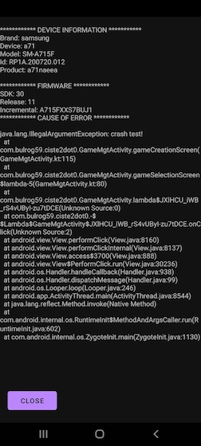

# ciste 2.0

## What is it?

An open-source android application to create/play on your mobile treasure hunts where people have to find checkpoints in the real world and solve puzzles.

If you look for high-res graphics, amazing soundtracks, videos, animations... you can turn around but if you want to unleash your creativity without coding skills then you came to the right place!

If you want to add new capabilities to this game just clone this repo. It allows to build the ciste 2.0 application.

This was built with android studio 4.2.1 and tested on a samsung s7, a71 and a redmi 9 (as of March 2022).

## reporting an issue

In case of issue, just look if it is a know issue or create a new one [here](https://github.com/bulrog/cistev2-app/issues)

If the application crashes you should get such screen:

Providing such picture will help to debug and if big error good to get the top like on this picture and also the "caused by" in the text.

## deleting some game or/and an account

In case you want some games you have created or your account to be deleted, please contact the developer of the game.

## developer area 

### Android ndk requirements

To build you need then to install NDK (AndroidStudio-> preferences-> android SDK-> SDK tools-> NDK side by side) (1GB download starts)

Then add in the build.gradle of the app (version matches the one installed):

    ndkVersion '22.1.7171670'

Copy the OpenCV-android-sdk/sdk/native/libs in app/src/main/jnilibs

Then take from ndk folder the shared lib and put it in the same folder (merge with previous copy) (where Android installed it: ~/Library/Android/sdk/ndk/<version>/sources/cxx-stl/llvm-libc++/libs/)

When starting in debug mode the console will show:

    D/check: openCV ok

### How to setup download of data from firestore:

Create a project in firebase and generate as mentioned the key to access the project and add it at the root of the app folder.

Then change the security rule for the storage:

    rules_version = '2';
    service firebase.storage {
      match /b/{bucket}/o {
        match /{allPaths=**} {
        allow read;
        }
        
        match /{userId}/{allPaths=**} {
        allow read;
        allow write: if request.auth.uid == userId;
        }
      }
    }
    
 And in firestore DB, add a collection games and set the permission as follow:
 
    rules_version = '2';
    service cloud.firestore {
      match /databases/{database}/documents {
        match /games/{gameId} {
          allow read;
          allow write :if request.auth != null;
        }
      }
    }
    
### How to use openCV 4 in android sdk (already done for this project)

Based on this article: https://learnopencv.com/image-classification-with-opencv-for-android/

Made a new project with an empty activity

Download openCV4Android: https://opencv.org/releases/ (version 4.5.2)

Then import is as a module (File-> New-> Import module and name it openCV)
Then open the build.gradle of openCV and change:

    apply plugin: 'com.android.application'
    
To:

    apply plugin: 'com.android.library'

Also comment the 'applicationId' line of openCV so it is not seen as an app.

Then in project structure, choose the dependencies tab and add openCV as a module dependency to the app.

### how to publish on google play

You of course need a developer account on google play.

Then you need to create a signed bundle (not an APK) with android studio and the first time you need to create a keystore and a key so google play can see that next releases are all signed by the same entity. See more details [here](https://developer.android.com/studio/publish/app-signing#generate-key).